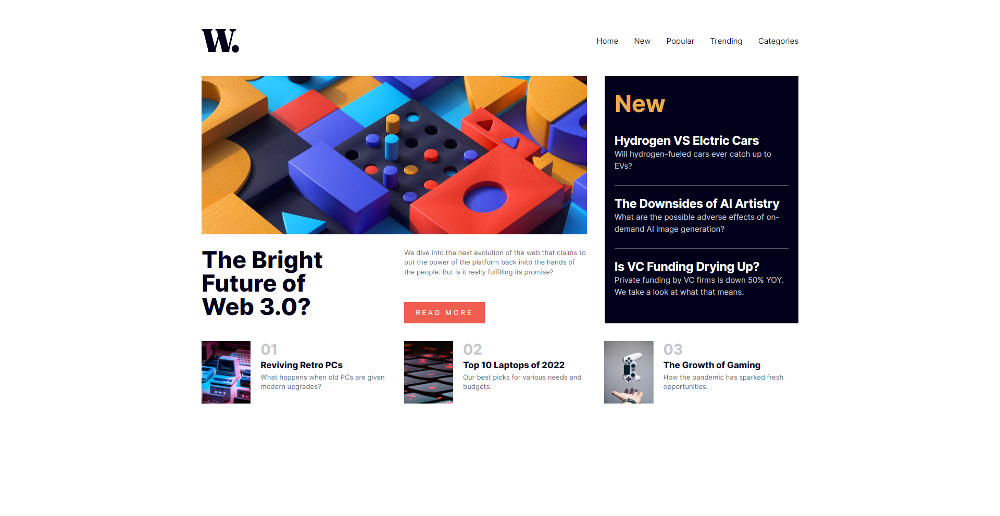

# Frontend Mentor - News homepage solution

This is a solution to the [News homepage challenge on Frontend Mentor](https://www.frontendmentor.io/challenges/news-homepage-H6SWTa1MFl).

## Table of contents

- [Overview](#overview)
  - [The challenge](#the-challenge)
  - [Screenshot](#screenshot)
  - [Links](#links)
- [My process](#my-process)
  - [Built with](#built-with)
  - [What I learned](#what-i-learned)
  - [Continued development](#continued-development)
  - [Useful resources](#useful-resources)

## Overview

### The challenge

Users should be able to:

- View the optimal layout for the interface depending on their device's screen size
- See hover and focus states for all interactive elements on the page

### Screenshot

### Links

- Solution URL: [Github](https://github.com/Nipaaaa1/news-homepage/)
- Live Site URL: [Github Pages](https://nipaaaa1.github.io/news-homepage/)

## My process

### Built with

- Semantic HTML5 markup
- Mobile-first workflow
- [React](https://reactjs.org/) - JS library
- [Tailwind CSS](https://tailwindcss.com/) - For styles

### What I learned

Container makes things more simpler. I don't know why I didn't use it. Anyway, this is just a simple project, it's a bit messy but at least it works.

### Continued development

Next time, I want to use Svelte to build another challenge. It's sounds simpler than React so maybe it's better?

### Useful resources

- [Tailwind CSS Docs](https://tailwindcss.com/docs) - Tailwind CSS docs had (almost) 90% of answers for any problem I'd face with tailwind.